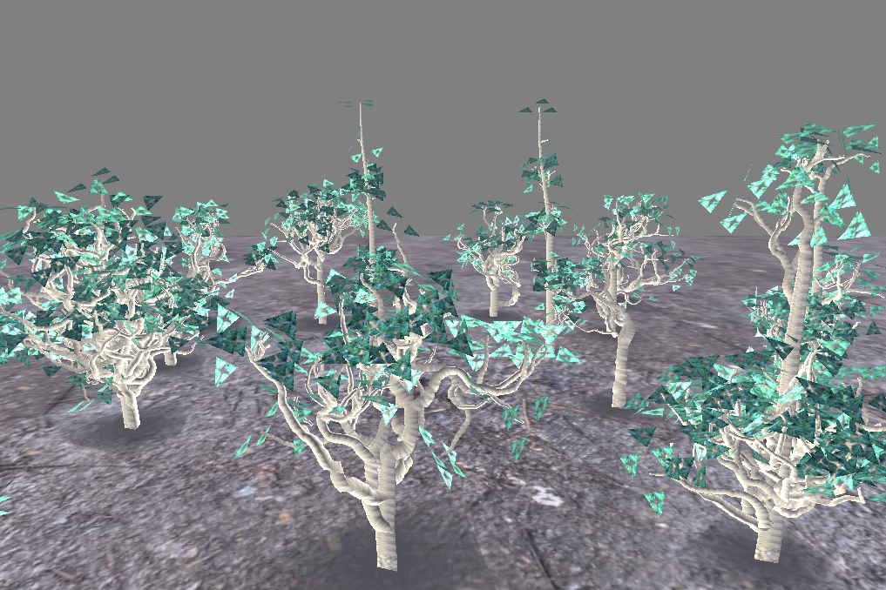

some ideas on procedural tree generation in C

* uses sokol for window framework/rendering https://github.com/floooh/sokol
* uses ctl for comtainers https://rurban.github.io/ctl/
* uses cglm for math https://github.com/recp/cglm

